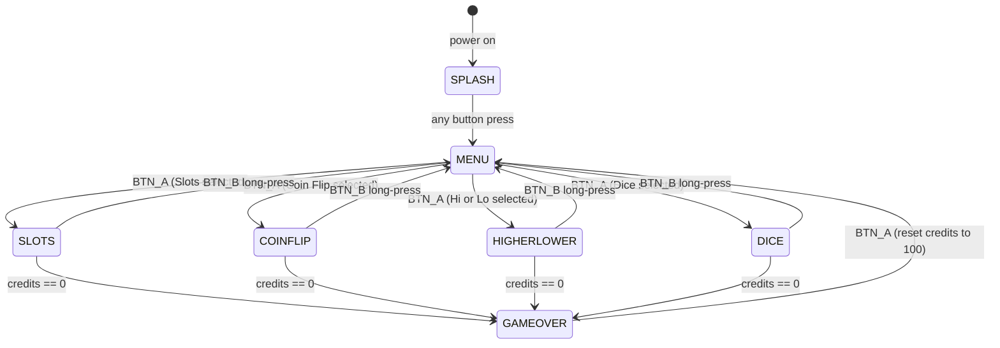
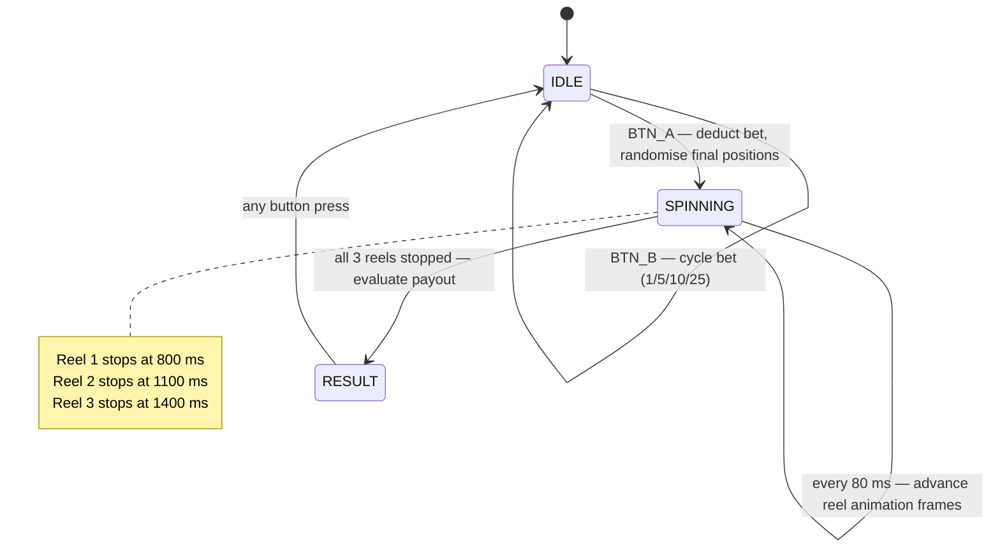
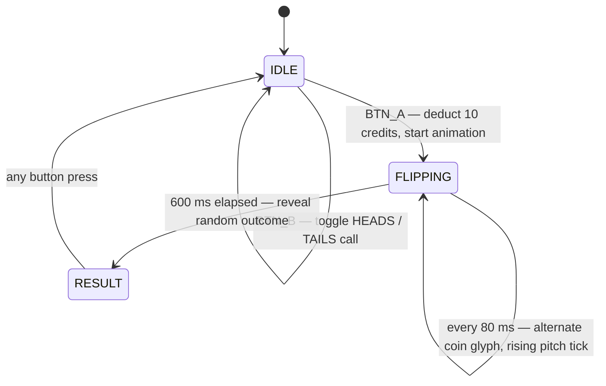
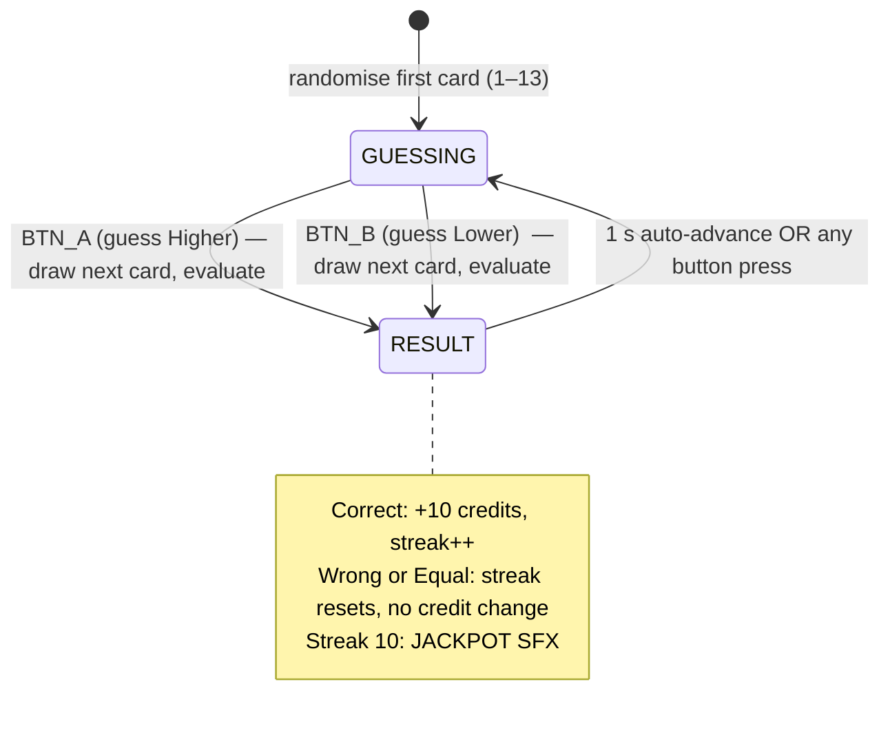
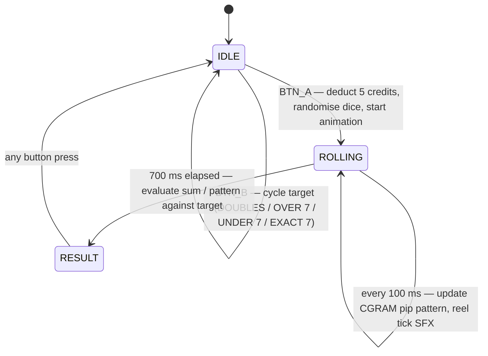

# Pocket Casino — State Machine Diagrams

## Top-Level UI FSM

---

## Slots Sub-FSM

Payout table:

| Outcome | Multiplier | SFX |
|---|---|---|
| 3× sevens | 50× bet | JACKPOT |
| 3× any match | 10× bet | WIN |
| 2× any match | 2× bet | WIN |
| No match | 0 | LOSE |

---

## Coin Flip Sub-FSM

Animation detail: pitch starts at 400 Hz and rises 50 Hz per frame over ~7 frames.

---

## Higher or Lower Sub-FSM

Card values: 1=A, 2–10=face value, 11=J, 12=Q, 13=K.
Equal value always loses.

---

## Dice Sub-FSM

Payout table:

| Target | Win Condition | Multiplier |
|---|---|---|
| DOUBLES | d1 == d2 | 5× bet |
| OVER 7 | d1 + d2 > 7 | 2× bet |
| UNDER 7 | d1 + d2 < 7 | 2× bet |
| EXACT 7 | d1 + d2 == 7 | 4× bet |
